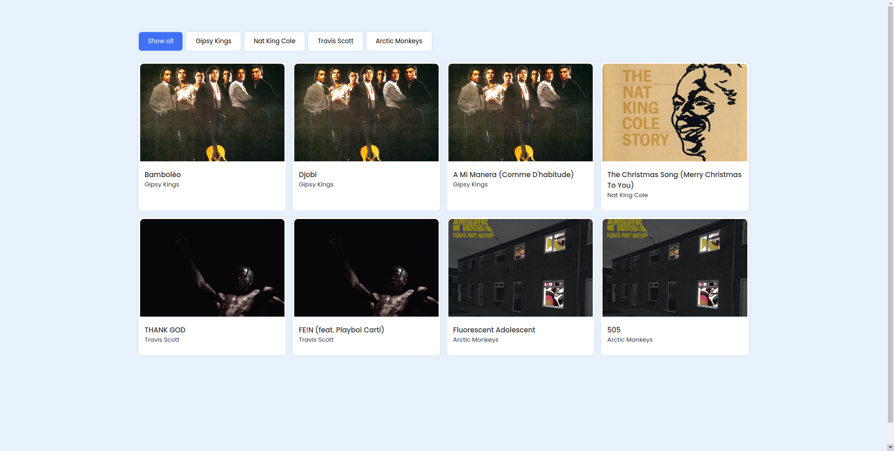
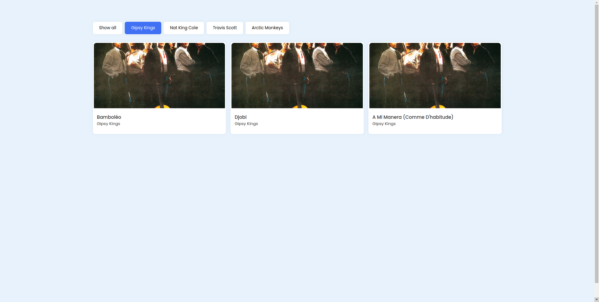

# Music Filter

Music Filter is a simple web application that allows you to filter and display songs by different artists. When you click on a button corresponding to an artist's name, the application will hide all songs by other artists, showing only the songs of the selected artist.

## Features

- Filter songs by artist name.
- Show all songs when the "Show all" button is clicked.
- Interactive and user-friendly interface.

## How to Use

1. Clone this repository to your local machine.
2. Open the `index.html` file in your web browser.

### Instructions

1. Click on the artist's name button to filter songs by that artist.
2. Click on the "Show all" button to display all songs again.

## Technologies Used

- HTML
- CSS
- JavaScript

## Screenshots

  
  

